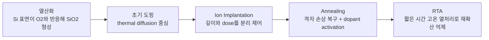

> 확산은 반도체 공정의 오래된 언어이고, 오늘날에는 단순 도핑보다 thermal budget을 읽는 중심 개념으로 남아 있다.

## What
- 확산은 고온에서 원자나 불순물이 농도 구배를 따라 퍼져 들어가는 열 기반 공정 축이다.
- 반도체 문맥에서는 하나의 단어로 끝나지 않는다. 실제 이해 흐름은 **열산화 -> 도핑 -> [[이온주입]] -> [[어닐링]] -> [[RTA]]**까지 이어진다.
- 과거에는 도핑 자체도 diffusion 방식이 많았지만, 미세화 이후에는 정밀 제어를 위해 [[이온주입]]이 중심이 되었고, 확산은 이후 열처리와 profile 변화, 산화막 형성, thermal budget 관리의 언어로 더 자주 읽힌다.

## How
- 열 에너지에 의해 원자가 이동하므로 본질적으로 등방성(isotropic) 성격이 강하다.
- 이 성격 때문에 깊이뿐 아니라 옆 방향으로도 퍼지는 **lateral diffusion**이 생기고, 미세 패턴에서는 이것이 junction profile을 흐리게 만든다.
- [source:SK하이닉스 뉴스룸] 관점으로 보면, 초기 도핑은 diffusion 기반이 많았지만 MOSFET 시대 이후에는 원하는 깊이와 dose를 분리 제어할 수 있는 [[이온주입]]으로 축이 옮겨갔다.
- 이온주입 이후에는 격자 손상과 비정상 위치(interstitial) 문제를 풀기 위해 [[어닐링]]이 붙고, 현대 공정에서는 furnace보다 [[RTA]] 같은 짧고 국소적인 열처리가 더 자주 쓰인다.

## Why
- 과거 큰 feature size에서는 thermal diffusion이 단순하고 결정 손상이 작아 충분히 실용적이었다.
- 하지만 미세화 이후에는 "불순물을 넣을 수 있는가"보다 **"원하는 위치와 농도로 얼마나 정확히 제어할 수 있는가"**가 더 중요해졌다.
- diffusion 방식은 시간/온도에 의존하는 간접 제어라 깊이와 농도를 독립적으로 맞추기 어렵고, lateral diffusion 때문에 미세 소자에서는 치명적인 profile 번짐이 생긴다.
- 그래서 주 도핑 수단은 [[이온주입]]으로 이동했고, 확산은 오늘날 **열산화의 성장 메커니즘**, **어닐링 중 재확산 위험**, **thermal budget 관리**를 설명하는 핵심 축으로 남아 있다.

## Measure
- 핵심 지표는 junction depth, sheet resistance, 산화막 두께, thermal budget, lateral diffusion 흔적이다.
- 확산/열처리 이후에는 목표 프로파일이 얼마나 퍼졌는지와, 그 흔적이 [[문턱전압]], [[Subthreshold Slope]], [[누설전류]]에 어떤 영향을 남겼는지를 함께 봐야 한다.
- 열산화에서는 막 두께뿐 아니라 active area 형상 변화, isolation 경계 변화까지 같이 봐야 한다.

## Connections
- [[열산화]]
- [[확산과 이온주입]]
- [[확산 vs 이온주입]]
- [[이온주입]]
- [[어닐링]]
- [[RTA]]
- [[문턱전압]]
- [[계측]]
- [[소자 특성 분석]]
- [[수율 분석]]

## Open Questions
- millisecond anneal, flash anneal, laser anneal까지 포함한 최신 activation 전략을 별도 비교 노트로 확장할 수 있다.
- 확산이라는 단어 아래 산화공정과 도핑공정을 어디까지 함께 묶을지 더 정교한 분리가 가능하다.

## 확산 파트에서 같이 봐야 하는 전체 흐름


## Thermal Diffusion vs Ion Implantation
| 관점 | Thermal Diffusion | Ion Implantation |
|------|-------------------|------------------|
| 방향성 | 열에 의해 등방성으로 퍼짐 | 가속 이온이 수직 방향으로 주입됨 |
| 깊이 제어 | 시간/온도로 간접 제어 | 가속 에너지로 직접 제어 |
| 농도(dose) 제어 | 표면 농도와 확산 계수에 의존 | dose를 직접 설정 가능 |
| Lateral diffusion | 수평 방향으로도 퍼져 미세 소자에 불리 | 상대적으로 작아 미세 패턴 유지에 유리 |
| 결정 손상 | 거의 없음 | 격자 손상 발생 -> [[RTA]] 필수 |
| 적합한 시대 | 큰 feature size와 단순 구조 | 미세화된 MOSFET, shallow junction 시대 |

- thermal diffusion은 "부드럽지만 퍼지는 공정"이고, ion implantation은 "손상은 주지만 정밀하게 박아 넣는 공정"이다.
- 미세화 시대에는 손상 자체보다 **깊이/농도 제어력**과 **lateral diffusion 억제력**이 더 중요한 요구가 되면서 중심축이 이동했다.

## 열산화 설명 정정
- 열산화는 Si 표면이 O2와 반응해 SiO2를 형성하는 과정이다.
- 여기서 정확한 표현은 "웨이퍼를 손상시킨다"가 아니라, **Si가 실제로 소비되며 기하 구조가 변한다**는 것이다.
- 일반적으로 형성된 산화막 두께 중 약 44%에 해당하는 Si가 아래쪽에서 소모된다.
- 그래서 STI나 active 영역 경계에서는 단순 막 성장으로 끝나는 것이 아니라, 형상 변화와 thermal budget까지 함께 관리해야 한다.

## 시각적 비교
```text
[Thermal Diffusion]     [Ion Implantation]     [Annealing / RTA]
표면에서 열로 퍼짐       가속 이온 수직 주입      격자 회복 + 활성화
등방성 ↕↔              깊이/dose 독립 제어      빠른 고온, 재확산 억제
```

## 💡 생각해보기
- 같은 junction depth를 목표로 할 때, 확산과 이온주입 중 어느 방식이 wafer 내 균일도와 소자 간 편차를 더 잘 잡을까?
- 열산화에서 "Si가 소비된다"는 사실이 active area 형상과 isolation 설계에 어떤 제약을 줄까?
- furnace anneal보다 RTA가 주류가 된 이유를 "더 빠르다" 수준이 아니라 **activation vs 재확산 억제 trade-off**로 설명할 수 있을까?
